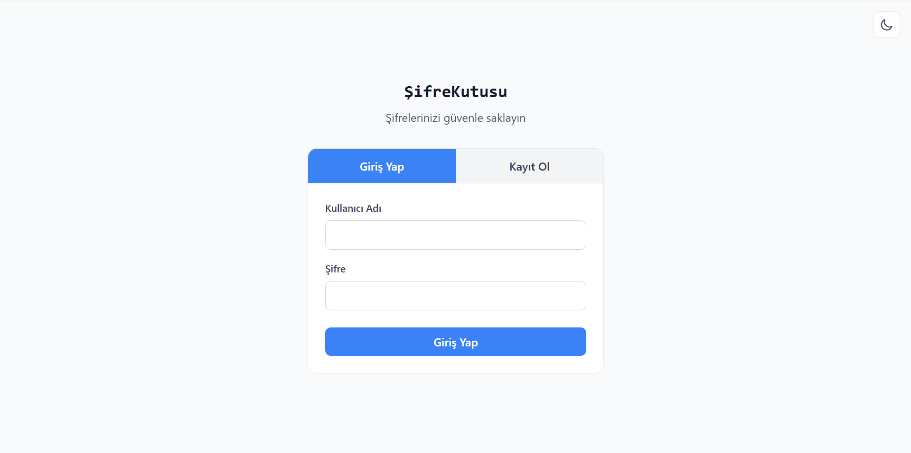
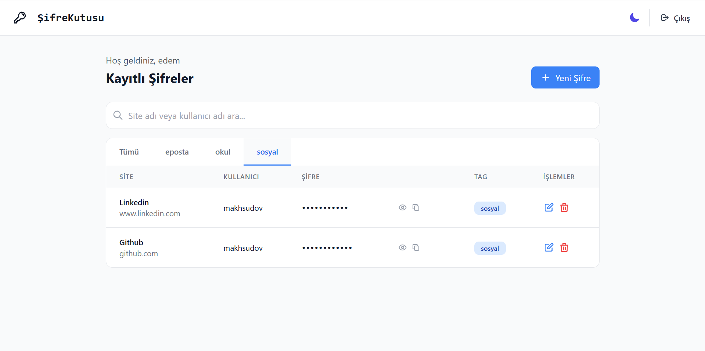
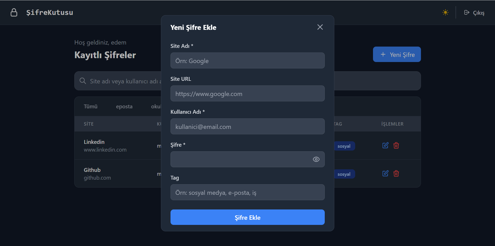

# ŞifreKutusu - Güvenli Şifre Yöneticisi

Modern ve güvenli bir web tabanlı şifre yöneticisi uygulaması. Tüm şifrelerinizi güvenle saklayın ve yönetin.

## 🔐 Özellikler

- **Güvenli Kullanıcı Sistemi**: Kayıt olma ve güvenli giriş yapma
- **Şifre Yönetimi**: Şifre ekleme, düzenleme, görüntüleme ve silme (CRUD işlemleri)
- **Güvenlik**: 
  - Şifreler AES-256-CBC algoritması ile şifrelenir
  - Kullanıcı şifreleri password_hash() ile güvenle saklanır
  - Session tabanlı kimlik doğrulama
- **Gelişmiş Filtreleme**: Tag'lere göre filtreleme ve arama özelliği
- **Modern Arayüz**: 
  - Responsive tasarım (mobil uyumlu)
  - Dark/Light tema desteği
  - TailwindCSS ile modern görünüm
- **Kullanıcı Dostu**: 
  - Şifre görünürlük kontrolü
  - Panoya kopyalama özelliği
  - Modal pencereler ile kolay düzenleme

## 📱 Ekran Görüntüleri

### Ana Sayfa (Giriş/Kayıt)


### Dashboard (Şifre Listesi)


### Şifre Ekleme Modal


## 🎥 Demo Video

[Uygulama Demo Videosu](https://youtu.be/wTkLXYwaaBc)

## 🛠️ Teknolojiler

- **Backend**: PHP
- **Frontend**: HTML, TailwindCSS, JavaScript
- **Veritabanı**: MySQL
- **Güvenlik**: OpenSSL (AES-256-CBC), password_hash()


## 🔧 Kurulum

### Yöntem 1: XAMPP ile Kurulum (Önerilen)
1. **XAMPP'ı indirin ve kurun**
   - [XAMPP](https://www.apachefriends.org/) resmi sitesinden indirin

2. **Servisleri başlatın**
   - XAMPP Control Panel'den Apache ve MySQL'i başlatın

3. **Projeyi kopyalayın**
   ```bash
   git clone https://github.com/makhsudov/SifreKutusu.git
   ```
   Projeyi `C:\xampp\htdocs\` klasörüne kopyalayın

4. **Uygulamayı açın**
   - Web tarayıcınızda `http://localhost/SifreKutusu/src/` adresine gidin

### Yöntem 2: Manuel Kurulum
1. **Dosyaları sunucuya yükleyin**
   ```bash
   git clone https://github.com/makhsudov/SifreKutusu.git
   ```

2. **Veritabanı ayarlarını yapılandırın**
   `src/config.php` dosyasındaki veritabanı bilgilerini güncelleyin:
   ```php
   $host = 'localhost';
   $dbname = 'password_manager';
   $username = 'your_username';
   $password = 'your_password';
   ```

3. **Veritabanını oluşturun**
   - Uygulama ilk çalıştırıldığında gerekli tablolar otomatik oluşturulur
   - Alternatif olarak `src/database.sql` dosyasını import edebilirsiniz

4. **Uygulamayı açın**
   Web tarayıcınızda `src/index.php` dosyasının bulunduğu URL'e gidin


## 🗂️ Dosya Yapısı

```
src/
├── index.php              # Ana giriş sayfası
├── dashboard.php          # Ana panel
├── config.php             # Veritabanı ve güvenlik ayarları
├── edit_password.php      # Şifre düzenleme işlemi
├── get_password.php       # Şifre verilerini getirme
├── logout.php             # Çıkış işlemi
├── theme_handler.php      # Tema değiştirme
└── database.sql           # Veritabanı şeması
```

## 🔐 Güvenlik Özellikleri

- **Şifre Hashleme**: Kullanıcı şifreleri PHP'nin password_hash() fonksiyonu ile güvenle saklanır
- **Veri Şifreleme**: Kayıtlı şifreler AES-256-CBC algoritması ile şifrelenir
- **Session Güvenliği**: Oturum yönetimi için güvenli session kullanımı
- **SQL Injection Koruması**: Prepared statements kullanımı
- **XSS Koruması**: htmlspecialchars() ile çıktı filtreleme

## 💻 Kullanım

1. **Kayıt Olun**: Kullanıcı adı, e-posta ve şifre ile hesap oluşturun
2. **Giriş Yapın**: Kullanıcı adı ve şifreniz ile giriş yapın
3. **Şifre Ekleyin**: "Yeni Şifre" butonu ile yeni kayıtlar ekleyin
4. **Yönetin**: Şifrelerinizi görüntüleyin, düzenleyin veya silin
5. **Filtreleyin**: Tag'ler veya arama ile şifrelerinizi kolayca bulun

## 🎨 Özellikler

- **Responsive Tasarım**: Tüm cihazlarda mükemmel görünüm
- **Dark/Light Tema**: Kullanıcı tercihine göre tema değiştirme
- **Tag Sistemi**: Şifrelerinizi kategorilere ayırın
- **Arama**: Hızlı şifre bulma özelliği
- **Güvenli Kopyalama**: Şifreleri güvenle panoya kopyalayın


## 📝 Lisans

Bu proje Bursa Teknik Üniversitesi BLM0226 Web Tabanlı Programlama dersi kapsamında hazırlanmıştır. Bu proje eğitim amaçlıdır.
